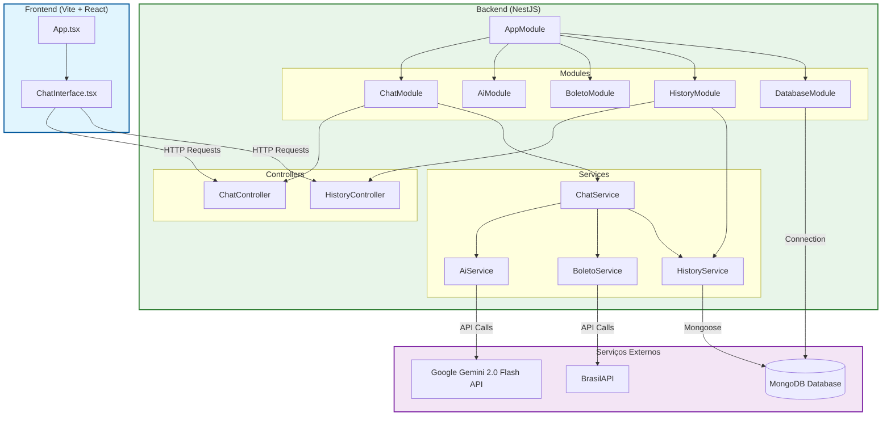

# Arquitetura do Sistema Boleto Sem Medo

Este documento descreve a arquitetura do projeto "Boleto Sem Medo", detalhando os componentes do Frontend, Backend e suas interações com serviços externos.

## Diagrama de Arquitetura

## Explicação dos Componentes

### 1. Frontend (Client)
O frontend é construído com **Vite**, **React** e **TypeScript**.
-   **Estilização**: Utiliza **TailwindCSS** e componentes da biblioteca **Radix UI**.
-   **Componente Principal**: `ChatInterface` é o componente central que gerencia a interação do usuário com o chat.
-   **Comunicação**: Realiza requisições HTTP para o backend (API NestJS) para enviar mensagens e buscar histórico.

### 2. Backend (Server)
O backend é uma aplicação **NestJS** modularizada.

#### Módulos Principais:
-   **AppModule**: O módulo raiz que orquestra todos os outros módulos.
-   **ChatModule**: Gerencia a lógica do chat.
    -   **ChatController**: Recebe as requisições do frontend.
    -   **ChatService**: Processa as mensagens, coordena chamadas para a IA e serviços de boleto.
-   **AiModule**: Encapsula a lógica de inteligência artificial.
    -   **AiService**: Comunica-se com a API do **Google Gemini 2.0 Flash** para processar texto e imagens.
-   **BoletoModule**: Contém a lógica de negócios específica para validação e leitura de boletos.
    -   **BoletoService**: Realiza validações e consulta dados de CNPJ e bancos via **BrasilAPI**.
-   **HistoryModule**: Gerencia o histórico de transações/conversas.
    -   **HistoryService**: Salva e recupera dados do banco de dados.
-   **DatabaseModule**: Configura a conexão com o banco de dados.

### 3. Serviços Externos
-   **MongoDB**: Banco de dados NoSQL utilizado para persistir o histórico de conversas e transações. A conexão é gerenciada via **Mongoose**.
-   **Google Gemini 2.0 Flash API**: Serviço de IA utilizado para interpretar o conteúdo dos boletos e gerar respostas para o usuário.
-   **BrasilAPI**: API pública utilizada para consultar dados de CNPJ e informações bancárias.

## Fluxo de Dados Típico
1.  O usuário envia uma mensagem ou imagem de boleto via `ChatInterface`.
2.  A requisição chega ao `ChatController` no backend.
3.  O `ChatService` processa a requisição:
    -   Usa o `AiService` para analisar o texto ou imagem (Gemini).
    -   Usa o `BoletoService` para validações específicas (BrasilAPI).
    -   Usa o `HistoryService` para salvar a interação.
4.  A resposta é devolvida ao frontend e exibida ao usuário.
